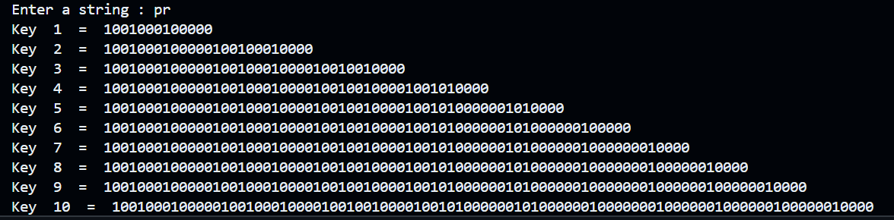
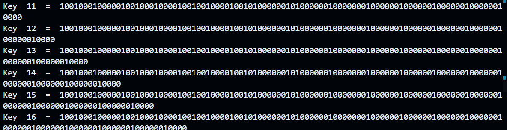
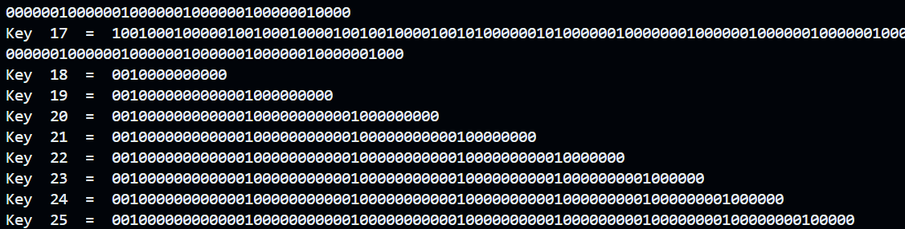
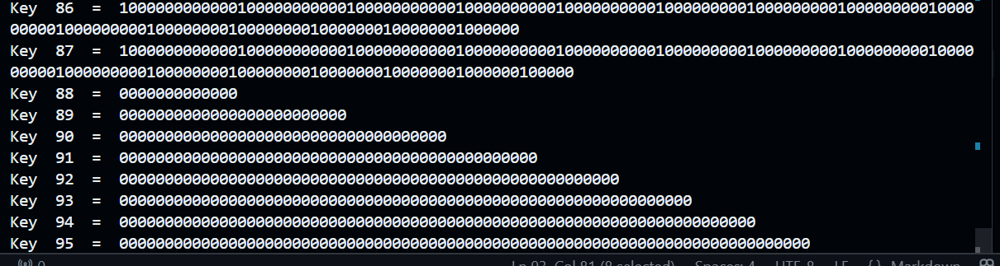

# Binary Shift Encryption Algorithm

## Overview
This Python program implements a custom binary shift encryption algorithm that generates 8 unique keys from an input string. It transforms the input into binary, manipulates the bits, and generates keys using shifting and randomization techniques.

## How It Works
1. **Convert Input String to Binary:**
   - The input string is converted into its 8-bit binary representation.
   - The first bit of each character is ignored, as it indicates the sign.

2. **Divide Binary Data into Left and Right Halves:**
   - The processed binary string is split into two equal halves: Left and Right.

3. **Bit Shifting and Key Generation:**
   - A predefined shift box (`lt = [2,3,6,7,1,6,5,9]`) determines the shifting pattern.
   - Both halves are converted to integers and shifted accordingly.
   - The new key is formed by merging the shifted halves.

4. **Random Bit Removal for Final Key Formation:**
   - 8 random positions are selected, and the corresponding bits are removed.
   - The final processed string is stored as a key.

5. **Display Generated Keys:**
   - The program prints 8 unique keys generated from the binary shifts and randomization process.

## Code Explanation
1. **Binary Conversion:**
   ```python
   result = ''.join(format(ord(i),'08b') for i in s)
   ```
   - Each character is converted into an 8-bit binary format.
   - The first bit (sign bit) is ignored.
   
2. **Splitting the Binary String:**
   ```python
   l = int(len(answer)/2)
   left = answer[:l]
   right = answer[l:]
   ```
   - The processed binary string is divided into left and right halves.

3. **Shifting and Merging:**
   ```python
   nl = int(left,2)
   nl = bin(nl<<lt[i])
   nr = int(right,2)
   nr = bin(nr<<lt[i])
   newKey = nr[num:]+nl[num:]
   ```
   - Each half is converted to an integer and shifted using values from `lt`.
   - The two shifted halves are merged to form the key.

4. **Random Bit Removal:**
   ```python
   rm =[]
   while(len(rm) != 8):
       r = random.randint(0,len(newKey)-1)
       if(r not in rm):
           rm.append(r)
   ```
   - Random positions are selected for removal.
   - The final key is constructed by omitting these bits.

5. **Printing the Keys:**
   ```python
   for i in range(0,len(keys)):
       print("Key ",i+1," = ",keys[i])
   ```
   - The generated keys are displayed.

## Example Output
```
Enter a string: HELLO
Key 1 = 1010101100...
Key 2 = 0110010101...
...
Key 8 = 1100111001...
```

## Applications
- Custom encryption techniques.
- Key generation for cryptographic systems.
- Bit-level data manipulation studies.

## Dependencies
- Python 3.x
- `random` module (built-in)

## Notes
- This is a **custom encryption method** and **not a standard cryptographic algorithm**.
- The randomness in key generation makes it difficult to predict outputs.

](image-3.png)