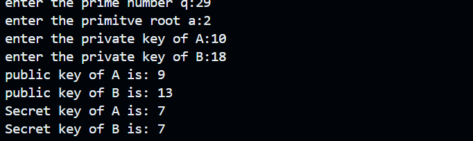

## Diffie-Hellman Key Exchange Implementation
This repository contains a simple Python implementation of the Diffie-Hellman Key Exchange algorithm. Diffie-Hellman is a method used to securely exchange cryptographic keys over a public channel.

## How It Works
The code implements the following steps:

The user inputs:
A prime number q
A primitive root a
Private keys for both users: Xa (for user A) and Xb (for user B)
The public keys for both users are computed using:
Ya = pow(a, Xa, q)
Yb = pow(a, Xb, q)
Each user then computes a shared secret key using the other user's public key:
Ka = pow(Yb, Xa, q)
Kb = pow(Ya, Xb, q)
The values of the public keys and shared secret keys are printed.
## How to Run the Code
Clone the repository.
Ensure you have Python installed (Python 3 recommended).
Copy the following code into a Python script (e.g., diffie_hellman.py):
python code.py
Follow the prompts to enter the required values.
The script will output the public keys and the shared secret keys.
## Example Result
Enter the prime number q: 29
Enter the primitive root a: 2
Enter the private key of A: 10
Enter the private key of B: 18
Public key of A is: 9
Public key of B is: 13
Secret key of A is: 7
Secret key of B is: 7
## Notes
Ensure that q is a prime number and a is a primitive root modulo q.
The private keys Xa and Xb should be selected randomly but must be less than q.
The computed secret keys Ka and Kb must match for a successful key exchange.

output:
