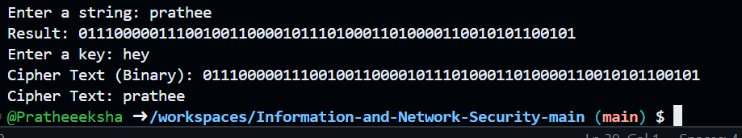

# Feistel Cipher Encryption

## Description
This Python program implements a **Feistel Cipher**, a symmetric structure used in many block cipher algorithms. The Feistel Cipher splits the plaintext into two halves and applies a round function with a given key, performing bitwise operations and swaps to generate ciphertext.

## Features
- **Feistel Network:** Implements a single round of Feistel ciphering.
- **Bitwise Operations:** Uses binary addition and XOR for encryption.
- **Dynamic Input Handling:** Converts input strings to binary for processing.
- **Basic Key-Based Encryption:** Uses an 8-bit binary key for transformation.

## Prerequisites
- Python 3.x

## How to Run
1. Clone or download the script.
2. Save the Python script file (e.g., `feistel_cipher.py`) in your working directory.
3. Navigate to the project directory:
   ```sh
   cd path/to/your/project
   ```
4. Run the script:
   ```sh
   python feistel_cipher.py
   ```
5. Enter the plaintext and key when prompted.

## Code Explanation
### Feistel Cipher Process
**Steps:**
1. **Convert Plaintext to Binary:**
   - The input string is converted to an 8-bit binary representation.
2. **Split into Halves:**
   - The binary data is divided into left and right halves.
3. **Feistel Function:**
   - The right half is modified using the key and bitwise addition.
   - XOR is applied with the left half.
4. **Swap and Repeat:**
   - The halves are swapped, and the function is applied again.
5. **Padding:**
   - If the final binary result is shorter than the original, zero-padding is applied.
6. **Convert Cipher Binary to Text:**
   - The binary result is converted back to a readable format.

## Example Execution
```sh
Enter a string: hello
Result: 0110100001100101011011000110110001101111
Enter a key: key
Cipher Text (Binary): 1011010001010111011011100110000111001101
Cipher Text: lWnaM
```

## Output
Upon running the script, you should see an output similar to:
```sh
Cipher Text (Binary): <encrypted_binary>
Cipher Text: <encrypted_message>
```


output:

