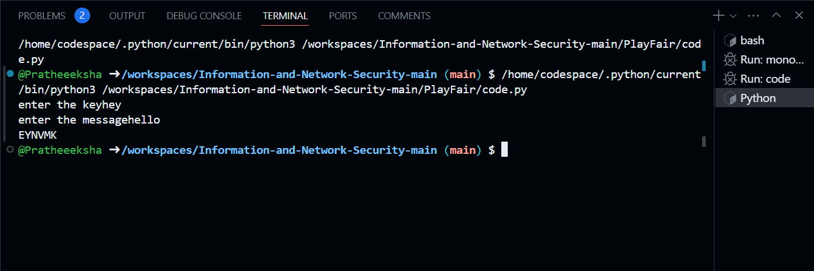

# Playfair Cipher

## Description
This Python program implements the **Playfair Cipher**, a digraph substitution cipher that encrypts pairs of letters in the plaintext. The cipher uses a 5x5 matrix of letters, constructed from a keyword (key), and the plaintext is encrypted according to specific rules based on the positions of the letters in the matrix.

### Key Features:
- Encrypts messages using the Playfair Cipher.
- Replaces the letter 'J' with 'I' (as the Playfair Cipher uses only 25 letters in the matrix).
- Handles repeated letters by inserting an 'X' between them.
- Can work with any alphabetic characters, but special characters and numbers are ignored.

## Technologies
- Python 3.x

## How to Run
1. download the script file.
2. Navigate to the project directory:
cd playfair-cipher
3. Run the Python program:
python playfair_cipher.py
4. The program will ask for two inputs:

Key: A string that will be used to create the Playfair Cipher matrix.
Message: The plaintext message that you want to encrypt.

## output 

Enter the key: MONARCHY
Enter the message: HELLO
Encrypted Message: BIPUL

## How it Works
Creating the Matrix:

The key (provided by the user) is used to create the first part of a 5x5 matrix. The matrix is then completed with the remaining letters of the alphabet (skipping 'J').
Preparing the Message:

The message is converted to uppercase, and 'J' is replaced with 'I'.
The message is split into pairs of letters. If there is a repeated letter (e.g., "LL"), an 'X' is inserted between them (e.g., "LX").
Encryption:

Each pair of letters is encrypted using the rules of the Playfair Cipher:
If the letters appear in the same row, they are replaced by the letters immediately to their right.
If the letters appear in the same column, they are replaced by the letters immediately below them.
If the letters are in different rows and columns, they form a rectangle, and the letters at the corners of the rectangle (same row but opposite column) are used.

Output:
The encrypted message is returned and printed.
Notes
Only alphabetic characters (A-Z) are considered. Numbers and special characters are ignored.
The letter 'J' is treated as 'I' in the Playfair Cipher.
The key should not contain duplicate letters.

## Notes

Only alphabetic characters (A-Z) are considered. Numbers and special characters are ignored.
The letter 'J' is treated as 'I' in the Playfair Cipher.
The key should not contain duplicate letters.

output image:

