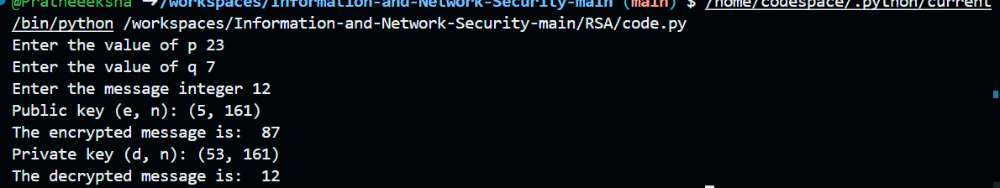

# RSA Encryption and Decryption

## Overview
This Python program demonstrates the RSA encryption and decryption process. It generates a public-private key pair, encrypts a message, and then decrypts it using RSA principles.

## How It Works
1. **User Inputs:**
   - Two prime numbers `p` and `q`.
   - A message `m` in integer form.

2. **Compute Values:**
   - `n = p * q` (modulus for keys)
   - `phi = (p-1) * (q-1)` (Euler's totient function)

3. **Generate Public Key:**
   - Find a small integer `e` such that `gcd(e, phi) = 1`.
   - The public key is `(e, n)`.

4. **Encrypt the Message:**
   - `C = (m^e) mod n` (ciphertext calculation)

5. **Generate Private Key:**
   - Compute `d = e^(-1) mod phi`, which is the modular inverse of `e`.
   - The private key is `(d, n)`.

6. **Decrypt the Message:**
   - `M = (C^d) mod n` (recovering the original message `m`).

## Code Explanation
1. **User Input:**
   ```python
   p = int(input("Enter the value of p "))
   q = int(input("Enter the value of q "))
   m = int(input("Enter the message integer "))
   ```
   - User enters two prime numbers and the message to be encrypted.

2. **Calculate `n` and `phi(n)`:**
   ```python
   n = p * q
   phi = (p - 1) * (q - 1)
   ```
   - `n` is the product of `p` and `q`, used in both public and private keys.
   - `phi` is Euler's totient function.

3. **GCD Function:**
   ```python
   def gcd(a, b):
       while b:
           a, b = b, a % b
       return a
   ```
   - This function finds the greatest common divisor (GCD) of two numbers.

4. **Finding `e` for Public Key:**
   ```python
   for i in range(2, phi):
       if gcd(i, phi) == 1:
           e = i
           break
   ```
   - Finds the smallest integer `e` that is coprime with `phi`.

5. **Print Public Key:**
   ```python
   print("Public key (e, n):", (e, n))
   ```
   - Displays the public key.

6. **Encrypt the Message:**
   ```python
   C = pow(m, e, n)
   print("The encrypted message is: ", C)
   ```
   - Encrypts `m` using `C = (m^e) mod n`.

7. **Compute `d` for Private Key:**
   ```python
   d = pow(e, -1, phi)
   print("Private key (d, n):", (d, n))
   ```
   - Computes modular inverse `d` such that `d * e ≡ 1 (mod phi)`.

8. **Decrypt the Message:**
   ```python
   M = pow(C, d, n)
   print("The decrypted message is: ", M)
   ```
   - Recovers `M = (C^d) mod n`, which should match the original `m`.

## Example Output
```
Enter the value of p: 7
Enter the value of q: 17
Enter the message integer: 5
Public key (e, n): (3, 119)
The encrypted message is:  29
Private key (d, n): (27, 119)
The decrypted message is:  5
```

## Applications
- Secure communication
- Digital signatures
- Public-key cryptography

## Dependencies
- Python 3.x (No external libraries required)

## Notes
- `p` and `q` must be prime numbers.
- `m` must be an integer smaller than `n`.
- This is a basic implementation and does not handle large prime generation securely.


output:
