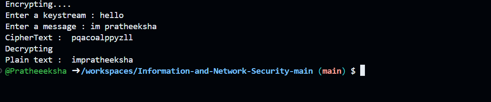

# Vigenère Cipher Encryption

## Description
This Python program implements the **Vigenère Cipher**, a method of encrypting alphabetic text using a form of polyalphabetic substitution. The cipher uses a repeating keyword to shift letters in the plaintext, making it more resistant to frequency analysis compared to simpler substitution ciphers.

## Features
- **Polyalphabetic Encryption:** Uses a repeating keystream for shifting letters.
- **Case Handling:** Converts plaintext to lowercase and removes spaces before encryption.
- **Dynamic Key Cycling:** The key repeats automatically to match the length of the message.
- **Encryption & Decryption:** Supports both encryption and decryption using modular arithmetic.

## Prerequisites
- Python 3.x

## How to Run
1. Clone or download the script.
2. Save the Python script file (e.g., `vigenere_cipher.py`) in your working directory.
3. Navigate to the project directory:
   ```sh
   cd path/to/your/project
   ```
4. Run the script:
   ```sh
   python vigenere_cipher.py
   ```
5. Enter the keystream and message when prompted.

## Code Explanation
### Vigenère Cipher Function
**Function Name:** `vignere(key, message)`

**Parameters:**
- `key`: The encryption key (converted to numerical shifts from 'a'=0 to 'z'=25).
- `message`: The plaintext message to be encrypted.

**Steps:**
1. Convert the plaintext to lowercase and remove spaces.
2. Convert each character in the key to a numerical shift.
3. For each letter in the plaintext:
   - Find the corresponding shift value from the key.
   - Shift the letter by the key’s numerical value using modular arithmetic (`(ord(letter) + key_shift - 97) % 26 + 97`).
4. Return the encrypted text.

### Decryption
- The decryption process follows the same approach but negates the key values.
- Applying the same function with `key = [-1 * k for k in key]` reverses the encryption, retrieving the original plaintext.

## Example Execution
```sh
Enter a keystream: key
Enter a message: vigenerecipher
CipherText: xkzldnvkwulqqhp

Decrypting
Plain text: vigenerecipher
```

## Output
Upon running the script, you should see an output similar to:
```sh
CipherText: <encrypted_message>
Plain text: <original_message>
```


output:
