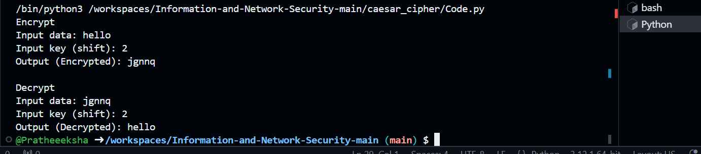

# Caesar Cipher Program

## Description
This Python program implements a **Caesar Cipher**, which is a type of substitution cipher where each letter in the plaintext is shifted by a specified number of positions in the alphabet. The program supports both encryption and decryption modes.

- **Encryption**: Shifts letters forward in the alphabet by a given number.
- **Decryption**: Shifts letters backward by the same number to restore the original text.

This is a basic implementation that works with both uppercase and lowercase letters, leaving non-alphabetic characters unchanged.

## Technologies
- Python 3.x

## How to Run
1. Clone the repository or download the script file.
   git clone https://github.com/yourusername/caesar-cipher.git
2. Navigate to the project directory:
   cd caesar-cipher
3.  Run the Python program:
    python caesar_cipher.py
4. The program will prompt you to input data and a shift key (an integer) for both encryption and 
   decryption.

## Usage
1. Encryption:
The program will ask for the plaintext and the shift key.
It will output the encrypted text after applying the Caesar Cipher.

2. Decryption:
The program will ask for the encrypted text and the same shift key.
It will output the decrypted text, returning it to the original form.

## output 

Encrypt
Input data: Hello World!
Input key (shift): 3
Output (Encrypted): Khoor Zruog!

Decrypt
Input data: Khoor Zruog!
Input key (shift): 3
Output (Decrypted): Hello World!

## Notes

1. The program works only for alphabetic characters (letters A-Z and a-z).
2. Non-alphabetic characters (such as spaces, punctuation, and numbers) are not altered during 
 encryption or decryption.
3. The shift key can be any integer, and it will automatically be wrapped around using modulo 26 to ensure it falls within the 0-25 range (the size of the alphabet).

output image :

