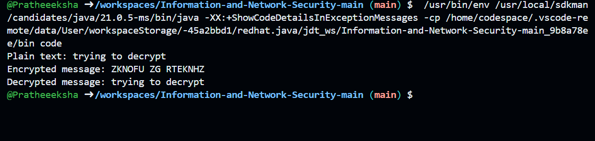

# Custom Alphabet Substitution Cipher

## Description
This Java program implements a **Custom Alphabet Substitution Cipher**, which encrypts and decrypts messages using a predefined substitution between normal lowercase English letters ('a' to 'z') and a coded set of uppercase letters ('Q' to 'M', 'A' to 'Z'). 

The cipher works by mapping each letter from the normal alphabet to a corresponding letter in the coded alphabet. Special characters (e.g., spaces, punctuation) are not encrypted and remain unchanged.

- **Encryption**: Maps lowercase English letters to uppercase letters according to the predefined cipher.
- **Decryption**: Reverses the encryption by mapping the coded uppercase letters back to the normal lowercase letters.

This is a simple substitution cipher suitable for demonstrating basic cryptography principles.

## Technologies
- Java 8 or higher

## How to Run
1.  download the repository
2. Navigate to the project directory:
   cd monoAlphabetic
3. Compile and run the Java program:
  javac code.java
  java code 
4. The program will display:

The original plain text.
The encrypted message.
The decrypted message (which should match the original plain text).    

## output:
Plain text: trying to decrypt
Encrypted message: wsbjxr wp wsdzjzk
Decrypted message: trying to decrypt

## How it Works:
Encryption:

The program compares each character of the input string with the normalChar[] array.
If the character is a lowercase letter, it finds the corresponding letter in the codedChar[] array and adds it to the encrypted string.
Special characters (e.g., spaces) are added to the encrypted string without modification.
Decryption:

The encrypted string is processed by comparing each character with the codedChar[] array.
For each match, it substitutes the character with the corresponding letter from the normalChar[] array.
Special characters remain unchanged.

## Notes

The cipher works only with lowercase English letters for encryption and uppercase English letters for the encoded message.
Special characters (e.g., spaces, punctuation) are left unchanged during both encryption and decryption.
This is a simple substitution cipher, not a secure cryptographic method for sensitive data.

output image:

